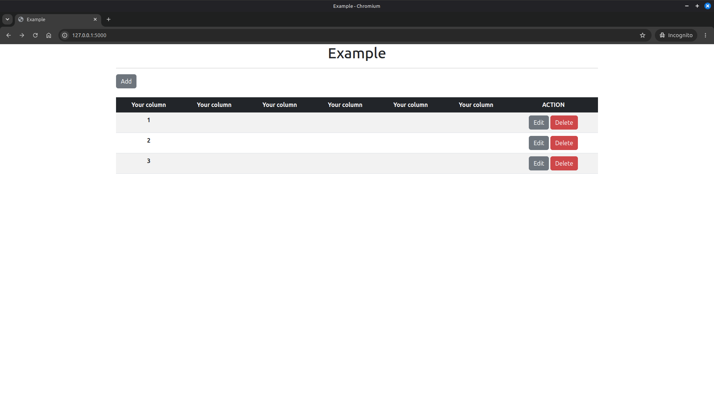

# Flask CRUD Template



A simple and lightweight template for building CRUD applications with Flask.

## 🛠️ Tech Stack


## ✨ Features

- CRUD with Flask
- SQLite database
- Flask SQLAlchemy integration
- Bootstrap 5 UI
- Jinja templates
- Easy to customize for your own projects

## 🚀 Getting Started

### 1. Create a virtual environment

```bash
python3 -m venv venv
```

### 2. Activate the virtual environment

**Linux/macOS**

```bash
source venv/bin/activate
```

**Windows**

```powershell
.\venv\Scripts\activate
```

### 3. Install dependencies

```bash
pip install -r requirements.txt
```

### 4. Configure the application

Edit `app.py`:

- Set your own `app.secret_key`
- Replace the example model with your own
- Rename routes and variables as needed
- Customize the UI using Bootstrap 5
- Before deploying, change:

```python
debug=True
```

to

```python
debug=False
```

### 5. Run the application

```bash
python3 app.py
```

## 📄 License

This project is licensed under the **MIT License**.